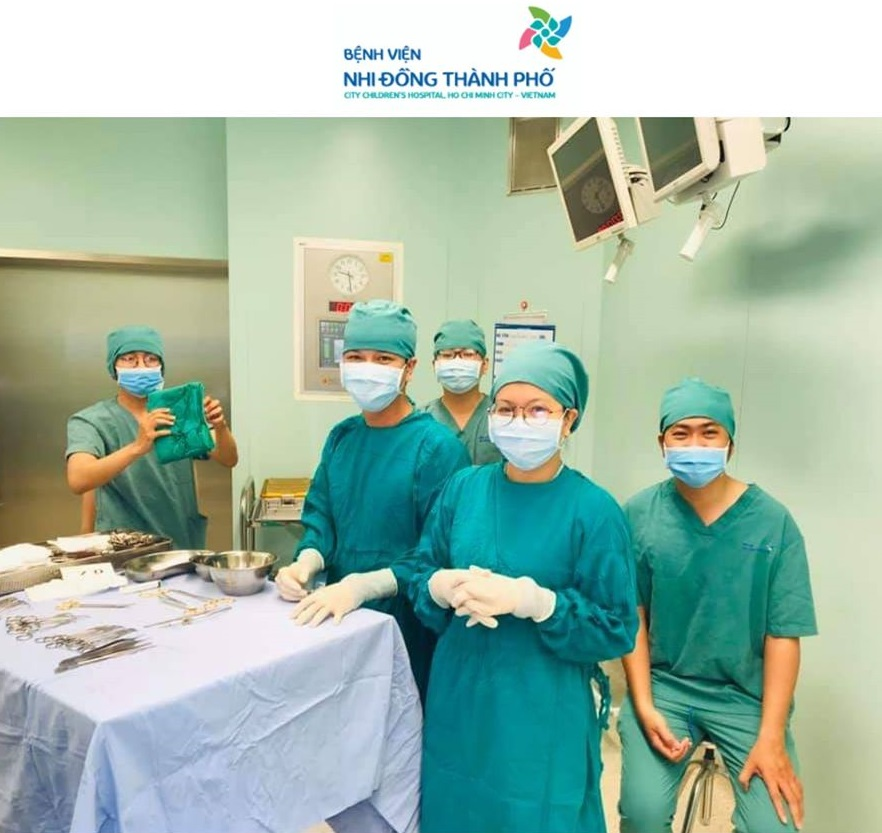

+++
title = "Khoa Ngoại Thần Kinh - Bệnh Viện Nhi Đồng Thành Phố" 
description = "Giới thiệu Khoa Ngoại Thần Kinh - Bệnh Viện Nhi Đồng Thành Phố"
+++

{{ team_logo(img_name="logo.jpg") }} Ca phẫu thuật thần kinh đầu tiên tại bệnh viện được thực hiện từ 30/5/2018, và ca chụp mạch máu não xóa nền đầu tiên được thực hiện vào 8/11/2018.

Hiện tại, chúng tôi có phòng mổ ngoại thần kinh rộng rãi được trang bị cơ sở vật chất hiện đại: kính vi phẫu Pentero 800, hệ thống định vị thần kinh (Navigation) Brainlab, hệ thống nội soi thần kinh, bộ dụng cụ phẫu thuật và vi phẫu thần kinh, máy DSA GE 630 chụp 2 bình diện,.. Và đặc biệt là hế thống Telemedicine giúp chúng tôi có thể truyền hình ảnh phẫu thuật trực tiếp ra bên ngoài phòng mổ phục vụ công tác hội chẩn và đào tạo.

Trong quá trình hoạt động, chúng tôi cũng nhận được sự hợp tác hỗ trợ từ các chuyên gia hàng đầu trong nước và quốc tế (Hoa Kỳ, Ireland, Bahrain,..) trong lĩnh vực phẫu thuật thần kinh nhi. Chúng tôi cũng có một đội ngũ với những chuyên gia hàng đầu của miền Nam với nhiều kinh nghiệm trong lĩnh vực cấp cứu, gây mê và hồi sức, phục hồi chức năng.

{{ resize_image(img_name="international1.jpg") }}
{{ resize_image(img_name="international2.jpg") }}

## NHÓM CHẤN THƯƠNG HỆ THẦN KINH, XUẤT HUYẾT NÃO KHÔNG DO CHẤN THƯƠNG

Chúng tôi đa tiếp nhận và phẫu thuật nhiều ca chấn thương sọ não và cột sống với đầy đủ các tổn thương, từ nhẹ đến nặng. Kết quả điều trị và tiên lượng phụ thuộc vào nhiều yếu tố như: sơ cấp cứu ban đầu, quá trình chuyến viện, chuẩn bị tiền phẫu, gây mê phẫu thuật, hồi sức nội khoa trước và sau mổ, phục hồi chức năng sau mổ…

Trong điều trị các biến chứng sau chấn thương, chúng tôi rất chú ý các biến chứng dễ bỏ sót sau chấn thương ở trẻ em như vỡ sọ tiến triển. Chúng tôi cũng có nhiều vật liệu để vá khuyết xương sọ sau chấn thương như titan, xi-măng, vis tự tiêu…

{{ resize_image(img_name="hematoma1.jpg") }}
{{ resize_image(img_name="hematoma2.jpg") }}
{{ resize_image(img_name="hematoma2.jpg") }}
{{ resize_image(img_name="hematoma2.jpg") }}

## NHÓM BỆNH LÝ TÂN SINH

Chúng tôi đã tiếp nhận phẫu thuật những bệnh nhi với khối u não và u tủy ở các vị trí khác nhau với sự trợ giúp của kinh vi phẫu. Trong những trường hợp khó như khối u kích thước nhỏ, vị trí sâu, đa ổ thì rất cần hệ thống định vị thần kinh giúp xác định vị trí tổn thương với sai số không quá 2 mm.

Điều trị nhóm bệnh này ngày nay thường áp dụng đa mô thức kết hợp phẫu thuật, hóa trị, xạ trị và di truyền học. Bệnh viện chúng tôi đang xây dựng trung tâm ung bướu nhi trong đó có đầy đủ các lĩnh vực: hóa trị, xạ trị, y học hạt nhân, chăm sóc giảm nhẹ, di truyền học…

{{ resize_image(img_name="tumor1.jpg") }}
{{ resize_image(img_name="tumor2.jpg") }}

## NHÓM BỆNH LÝ NÃO ÚNG THỦY VÀ CÁC DỊ TẬT BẨM SINH

Não úng thủy là một trong những bệnh lý hay gặp nhất trong ngoại thần kinh nhi. Có nhiều cách khác nhau để điều trị cho nhóm bệnh nhi này, tùy vào từng trường hợp cụ thể mà chúng tôi quyết định nội soi hoặc đặt dẫn lưu cho bệnh nhi. Chúng tôi có những loại dẫn lưu khác nhau, có thể tự điều chỉnh áp lực dòng chảy để hạn chế các biến chứng và phù hợp cơ chế bệnh sinh.

Đối với các bệnh nhân dính khớp sọ sớm, tùy vào từng thể bệnh mà có chỉ định can thiệp khác nhau. Có những trường hợp phức tạp, bệnh nhi phải trải qua 2 – 3 lần: tạo hình phần sọ trước, phần sọ sau cũng như sọ mặt.

Chúng tôi còn điều trị các bệnh liên quan đến dị tật cột sống chẻ đôi: U mỡ chóp tủy, thoát vị tủy màng tủy, tủy bám thấp,...

{{ resize_image(img_name="hydrocephalus1.jpg") }}
{{ resize_image(img_name="hydrocephalus2.jpg") }}

## NHÓM BỆNH LÝ MẠCH MÁU NÃO VÀ TỦY:

Chúng tôi đang dần hoàn thiện trong chẩn đoán và điều trị các bệnh lý mạch máu não: phình động mạch não, Moyamoya, dị dạng động tĩnh mạch não và tủy (AVM), dò động tĩnh mạch, dị dạng tĩnh mạch Galen… bằng cả phẫu thuật vi phẫu và can thiệp nội mạch.

{{ resize_image(img_name="vascular1.jpg") }}
{{ resize_image(img_name="vascular2.jpg") }}

## NHÓM BỆNH LÝ NHIỄM TRÙNG THẦN KINH:

Vai trò của phẫu thuật thần kinh trong nhóm bệnh lý này là giải áp và dẫn lưu dịch viêm để làm tăng vai trò của điều trị nội khoa và giảm thời gian nằm viện. Chúng tôi đã phẫu thuật nhiều ca tụ mủ dưới màng cứng, áp xe não, áp xe tủy…

{{ resize_image(img_name="infectious1.jpg") }}
{{ resize_image(img_name="infectious2.jpg") }}

## NHÓM PHẪU THUẬT THẦN KINH CHỨC NĂNG:

Chúng tôi cũng đang xây dựng mô hình đa chuyên khoa (ngoại thần kinh, thần kinh, chỉnh hình, phục hồi chức năng…) trong điều trị bệnh nhân bại não. Phẫu thuật thần kinh trong các trường hợp này là cắt rễ lưng thần kinh tủy (chọn lọc) hoặc cả rễ lưng và rễ bụng (không chọn lọc).

Ngoài ra, chúng tôi còn hợp tác hội chẩn sản nhi với các bệnh viện Từ Dũ, bệnh viện Hùng Vương, góp phần trong công tác chăm sóc tiền sản và chuẩn bị điều trị các thai có dị bẩm sinh ngay từ sau sinh.
Cuối cùng, chúng tôi xin tri ân sâu sắc đến toàn thể quý chuyên gia và quý đồng nghiệp đã luôn hỗ trợ chúng tôi, đến các bệnh nhân đã tin tưởng điều trị tại BV Nhi Đồng Thành Phố. Chúng tôi sẽ luôn nỗ lực trên chặn đường đầy thử thách phía trước để phấn đấu trở thành một trung tâm điều trị toàn diện về bệnh lý ngoại thần kinh nhi ở miền Nam.

{{ resize_image(img_name="functional1.jpg") }}
{{ resize_image(img_name="functional1.jpg") }}
